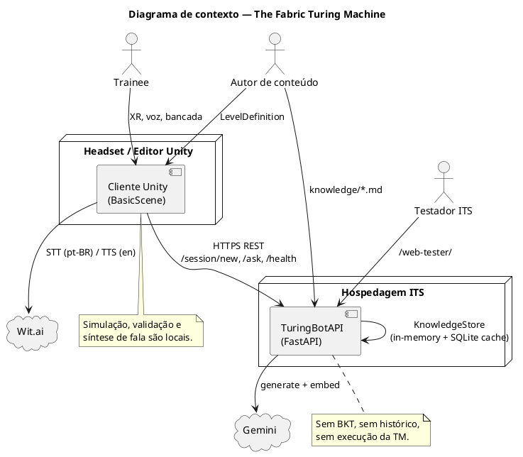
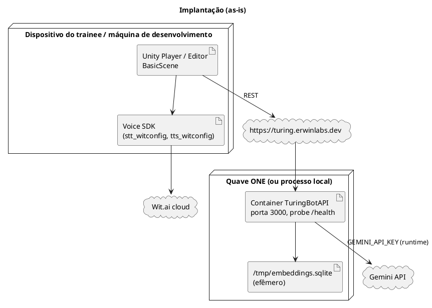
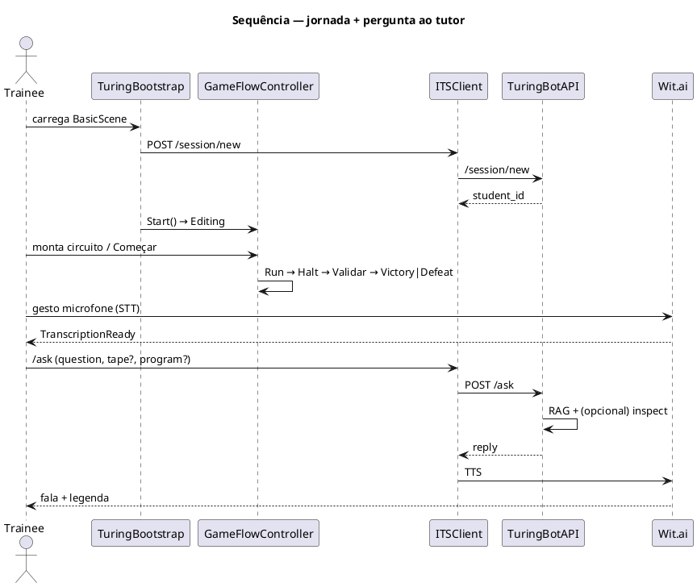
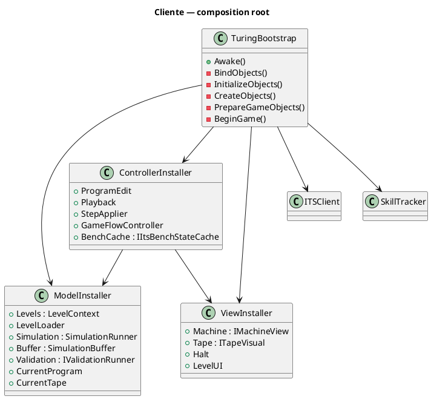
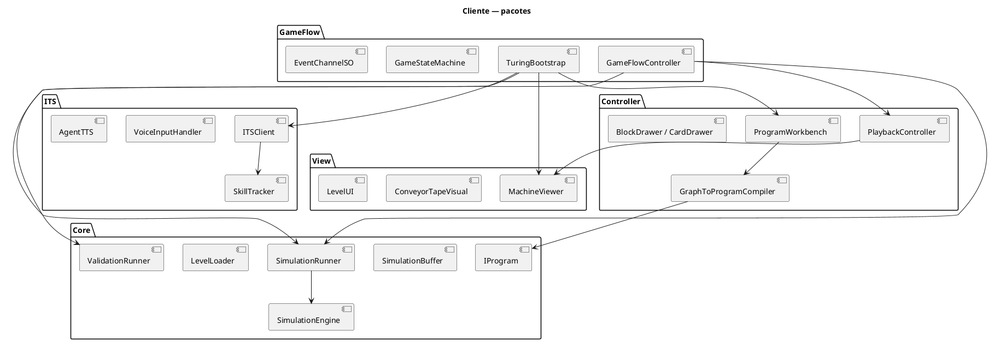
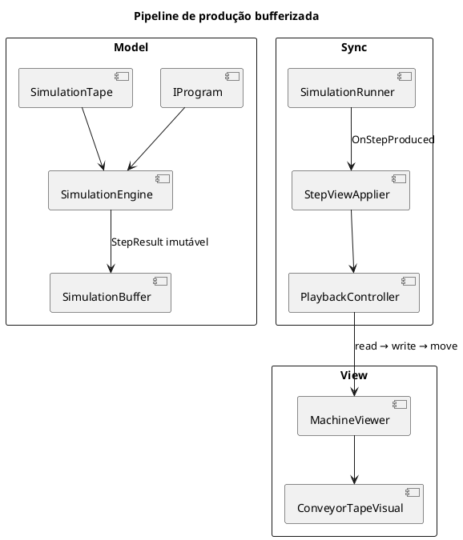
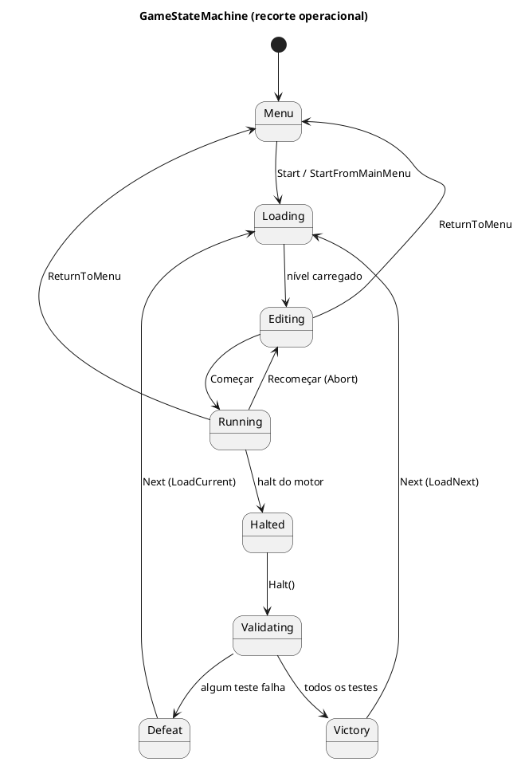
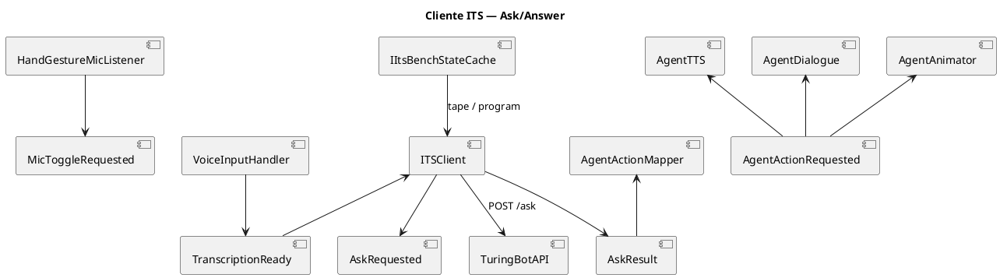
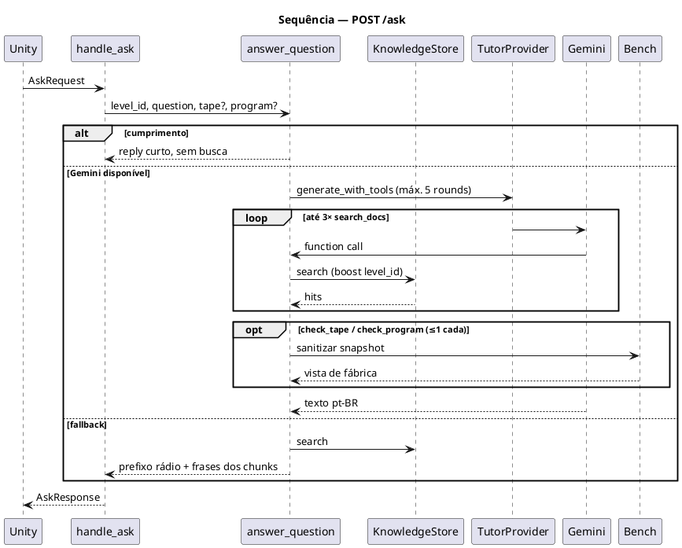
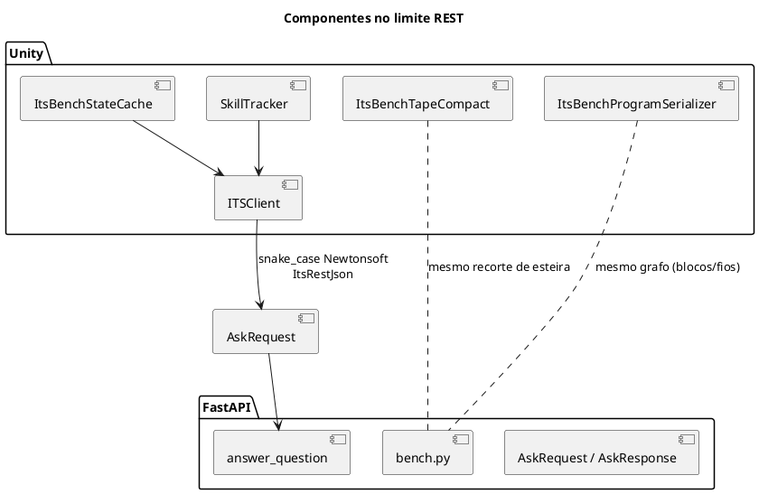

# Arquitetura do sistema — The Fabric Turing Machine

Documento de **arquitetura de software** do estado atual (as-is). Não descreve roadmap. A notação segue UML 2 (componentes, implantação, sequência, pacotes e máquinas de estado). Os diagramas estão em **PlantUML**.

Casos de uso correlatos: `docs/casos-de-uso.md`. Detalhe de Inspector e canais: `docs/client/`. Contrato HTTP vivo: `docs/server/README.md`.

---

## 1. Propósito e escopo

O sistema é um simulador pedagógico em realidade virtual: o trainee monta um **circuito** (programa visual de blocos e fios) que controla o **braço** e a **esteira** (fita de uma Máquina de Turing). Um tutor remoto (persona Claudio) responde perguntas em pt-BR.

Este documento fixa:

1. a **arquitetura do sistema** (limites, nós, contratos);
2. a **arquitetura do cliente** Unity/C#;
3. a **arquitetura do servidor** ITS FastAPI/Python.

Fora do escopo: implementação linha a linha, wiring de cada objeto de cena, e itens de backlog (BKT, WebSocket, menu UI completo).

---

## 2. Visão de contexto (sistema como um todo)

### 2.1 Estilo arquitetural

O produto é um **sistema cliente–servidor em duas runtimes**, com integração por **REST síncrono** e serviços de voz externos:

| Runtime | Tecnologia | Responsabilidade |
|---------|------------|------------------|
| Cliente | Unity (C# 11+), XR | Simulação TM, edição do circuito, validação de nível, orquestração de jogo, STT/TTS, apresentação |
| Servidor ITS | FastAPI (Python 3.11+) | Sessão efêmera, RAG agentico, resposta do tutor |
| Wit.ai | Meta Voice SDK | STT pt-BR (`turing_stt`) e TTS inglês (`turing_tts`) no **dispositivo** |
| Gemini | Google Generative AI | Chat (`gemini-2.5-flash`) e embeddings (`gemini-embedding-001`), chamados **só pelo servidor** |

O cliente **não** replica o cérebro do tutor. O servidor **não** executa a Máquina de Turing nem persiste o trabalho do trainee. A verdade da simulação fica no Model C#; a verdade fática do tutor fica no corpus `TuringBotAPI/knowledge/`.

### 2.2 Diagrama de contexto



### 2.3 Limites e invariantes de sistema

1. **Identidade de sessão.** `POST /session/new` devolve `student_{uuid}`. O servidor não armazena o aluno. O cliente guarda `student_id` em `SkillTracker` só para o payload de `/ask`. Voltar ao menu limpa a sessão local.
2. **Identidade de nível.** `LevelDefinition.levelId` (Unity) = `LevelID` = frontmatter `level_id` em `knowledge/goals/`. Oito níveis na progressão; `AppendScrew` não é jogável.
3. **Contrato `/ask`.** JSON `snake_case`: `student_id`, `level_id`, `question`, `tape?`, `program?`. Resposta: `{reply, tokens_in, tokens_out}`. Unity usa só `reply`. Timeout de 15 s. Host inalcançável → `AskResult` de sucesso com *“O rádio não ta muito bom.”*
4. **Snapshots.** `tape` e `program` são do request; o servidor não os persiste. `program` é o grafo da bancada (`blocos`/`fios`), não a tabela de transições compilada. `tape` é janela compacta `{cells, head_offset}`.
5. **Língua.** Texto jogável e `reply` em pt-BR. Áudio TTS ainda usa a voz inglesa `turing_tts`.
6. **Separação Model–View.** A View Unity não altera o Model. Passos imutáveis fluem pelo buffer de produção.

### 2.4 Implantação



Imagem: `TuringBotAPI/Dockerfile` (contexto `TuringBotAPI`). `GEMINI_API_KEY` é variável de runtime, não ARG de build. O mesmo processo serve a API Unity e o web tester em `/web-tester/`.

### 2.5 Fluxo ponta a ponta (visão de processo)



---

## 3. Arquitetura do cliente (Unity / C#)

### 3.1 Estilo

O cliente adapta **MVC** a um motor de jogo, com **composition root** único e **injeção por installers** (não por `Awake`/`Start` espalhados):

| Camada | Papel | Onde vive |
|--------|--------|-----------|
| **Model** | Dados e lógica da TM (programa, fita, motor, validação). Sem UnityEngine na regra de negócio. | `Assets/TuringSimulator/Core/` |
| **View** | Esteira, braço, halt, UI de nível, avatar, áudio/VFX. Consome pacotes; não escreve o Model. | `Assets/TuringSimulator/View/` |
| **Controller** | Bancada, compilação grafo→programa, input XR, playback, ITS, fluxo de estados. | `Controller/`, `GameFlow/`, `ITS/` |

Padrões concomitantes:

- **Pipeline de produção bufferizada** (Model → pacotes imutáveis → fila → interpolação da View).
- **Eventos via ScriptableObject** (`EventChannelSO<TPayload>`) para desacoplar gameplay, voz e reações do tutor.
- **Interface-first** nos sistemas de jogo mockáveis (`ISimulationEngine`, `IProgramEditController`, `ITapeVisual`, …). ITS de rede ainda usa concretos (`ITSClient`) no MVP.

### 3.2 Composition root e installers

`TuringBootstrap` é a raiz. Prefere referências da cena (`ViewSceneBindings`, `ControllerSceneBindings`); instancia prefabs só se faltar binding.



Fases de `Awake`:

1. `BindObjects` — resolve `ITSClient`, `SkillTracker`, `AgentTTS`, `AgentDialogue`.
2. `InitializeObjects` — `ModelInstaller.Install()`.
3. `CreateObjects` — `ViewInstaller` (cena, senão prefab).
4. `PrepareGameObjects` — `ControllerInstaller`; injeta `IItsBenchStateCache` no `ITSClient`.
5. `BeginGame` — `POST /session/new` e `GameFlowController.Start()`.

Arquivos: `TuringBootstrap.cs`, `ModelInstaller.cs`, `ViewInstaller.cs`, `ControllerInstaller.cs`.

### 3.3 Pacotes lógicos do cliente



### 3.4 Pipeline Model → Buffer → View



Invariantes:

- O motor (`SimulationEngine`) não conhece Unity visuals.
- Cada passo é um pacote de delta (símbolo, cabeçote, transição, halt).
- A execução lógica **não espera** a animação terminar: o buffer desacopla as velocidades.
- Halt visual (`HaltReached`) dispara `GameFlowController.Halt()` → validação **offline** dos cinco cenários do nível.

### 3.5 Máquina de estados do jogo

Estados relevantes do runtime: `Menu`, `Loading`, `Editing`, `Running`, `Halted`, `Validating`, `Victory`, `Defeat`. Transições ilegais são rejeitadas por `GameStateMachine.IsAllowed`.



Orquestrador: `GameFlowController` (`Start`, `Run`, `Abort`, `Halt`, `Next`, `ReturnToMenu`).

### 3.6 Edição do circuito

A bancada (`ProgramWorkbench`) é a fonte do programa autorado.

1. Gaveta de **blocos** na bancada; gaveta de **cartões** no braço esquerdo.
2. Fio da tomada de energia define a entrada do grafo dirigido. Sem esse fio, o programa é vazio (halt imediato).
3. `GraphToProgramCompiler` gera `IProgram` (tabela de transições). Falha de compile **mantém** o programa anterior.
4. `ProgramGraphFingerprint` evita recompilação se o grafo não mudou.
5. Halt do motor: estado Accept → `HaltStatus.Accept`; ausência de transição → `HaltStatus.Reject`. Move/Write sem fio compilam para sink não-final.

Durante a execução, o fio do caminho de energia usa `previewColor`; aborto restaura `connectedColor`.

### 3.7 Barramento de eventos

Canais são assets `EventChannelSO<T>`: publishers chamam `Raise`; listeners assinam `OnRaised`. O Inspector liga bindings sem código novo (`EventChannelActionListener`, `AgentActionMapper`).

Famílias:

| Família | Exemplos | Função |
|---------|----------|--------|
| Gameplay | `RunRequested`, `LevelLoaded`, `ProgramChanged`, `HaltReached`, `LevelOutcome` | ciclo de nível |
| Simulação/view | `SimulationStepProduced`, `PlaybackStep`, `TapeMoved`/`Read`/`Write` | pipeline e VFX |
| Voz/ITS | `MicToggleRequested`, `TranscriptionReady`, `AskRequested`, `AskResult` | Ask/Answer |
| Agente | `AgentActionRequested`, `ThinkingStateChanged` | fala + animação |

Mapa operacional: `docs/client/EVENT_DRIVEN_DEMO_EVENT_MAP.md`.

### 3.8 Integração ITS no cliente



- `SkillTracker` segura `student_id` e `level_id`.
- `ItsBenchStateCache` marca dirty em load de nível, materialização no Começar, passo de playback (esteira visível) e `ProgramWorkbench.GraphRebuilt`; só então recompõe snapshots. A esteira de `/ask` vem de `ITapeVisual.Snapshot`, não de `CurrentTape` nem do `ActivePlayTest` escondido.
- STT e TTS **não** compartilham o mesmo app Wit.
- Sem `ITSClient` na cena, `TranscriptionAskFallbackListener` ainda emite o fallback de rádio.

### 3.9 Dados de nível (cliente)

`LevelDatabase` ordena oito `LevelDefinition`. Cada um traz apresentação pt-BR, `levelId` e cinco `ValidationTest` em `validationTests`. No load, um membro do pool vira `ActivePlayTest` e a esteira fica vazia até **Começar**. Validação compara halt, índice do braço e conteúdo da esteira em **todo** o pool. Não há uma cena Unity por cenário.

---

## 4. Arquitetura do servidor (TuringBotAPI)

### 4.1 Estilo

Servidor **stateless** de tutoria: FastAPI + RAG agentico. Um processo, três endpoints de produto, corpus markdown versionado no Git.

Não há: banco de alunos, BKT, fila de eventos, WebSocket, execução da TM.

### 4.2 Componentes

```plantuml
@startuml
title Servidor ITS — componentes

package "API" {
  [main.py\nFastAPI] as API
  [web-tester] as Web
}

package "Tutor" {
  [agent.py\nanswer_question] as Agent
  [tutor_provider.py\nTutorProvider] as Provider
  [bench.py\nsanitizers] as Bench
}

package "RAG" {
  [rag/documents.py] as Docs
  [rag/store.py\nKnowledgeStore] as Store
  [knowledge/**/*.md] as MD
}

cloud Gemini

API --> Agent
API --> Web
Agent --> Store
Agent --> Provider
Agent --> Bench
Store --> Docs
Docs --> MD
Provider --> Gemini
Store --> Gemini : embeddings (se houver chave)
@enduml
```

Ciclo de vida (`lifespan`):

1. `setup_logging()`
2. `build_tutor_provider()` — Gemini se `GEMINI_API_KEY` existe; senão `FallbackTutorProvider`
3. `KnowledgeStore.from_directory(knowledge/)` — um chunk por arquivo, vetores em RAM, cache SQLite por `doc_id` + hash

CORS aberto (`allow_origins=["*"]`) para desenvolvimento e web tester.

### 4.3 Superfície HTTP

| Método | Rota | Contrato |
|--------|------|----------|
| `POST` | `/ask` | corpo `AskRequest`; 422 se `question` vazia; 200 `{reply, tokens_in, tokens_out}` |
| `POST` | `/session/new` | `{student_id}` |
| `GET` | `/health` | `{status, version, tutor_provider, documents}` |
| `GET` | `/` | redirect `/web-tester/` |

Removidos deste MVP: `/event`, `/hint`, `/state/{id}`, `/ws/live`.

`student_id` entra no log de `/ask` e **não** altera o modelo. `tape`/`program` são sanitizados em `bench.py` e expostos às tools `check_tape` / `check_program`.

### 4.4 Loop agentico



Regras do agente (`agent.py` + persona):

- Persona sempre no system prompt.
- Vocabulário de fábrica: esteira, execução do circuito, bloco, fio — não “fita/corrida/simulação” com o trainee.
- `search_docs` para como jogar, objetos e objetivo; inspect só para a esteira/circuito **deste** request.
- Recusa fora do ofício sem RAG de conteúdo alheio.
- Fallback offline: busca por tokens, sem inspect, recorte pt-BR sem notas de agente.

### 4.5 Camada de conhecimento

Cada markdown tem frontmatter `{id, category, title, level_id}`. Categorias: `persona`, `gameplay`, `objects`, `goals`, `concepts`. `search_docs` aplica `LEVEL_BOOST` (0,12) quando `level_id` coincide com o `/ask`.

Editar tutoria = editar `knowledge/`, não tabelas Python.

---

## 5. Contrato entre cliente e servidor



Alinhamentos obrigatórios numa mesma mudança:

- nomes JSON (`student_id`, `level_id`, `tape.cells`, `tape.head_offset`, `program.blocos`, `program.fios`, …);
- semântica da janela da esteira (padding em branco, `head_offset` real mesmo em esteira vazia);
- `levelId` Unity ↔ goals do servidor.

Testes de contrato: `TuringBotAPI/tests/` (pytest) e testes EditMode em `Assets/Tests/EditModeTests/` (serializer, cache, compactação de fita).

---

## 6. Qualidades e decisões

| Qualidade | Decisão |
|-----------|---------|
| **Pedagogia** | Circuito visual + validação em cinco lotes; tutor por voz, sem entregar o circuito completo sem pedido e sem nomear o lote que falhou. |
| **Desacoplamento simulação/visual** | Buffer de `StepResult`; View interpola. |
| **Testabilidade do Model** | Core C# isolado; installers injetam interfaces. |
| **Testabilidade do tutor** | Corpus markdown + pytest; web tester independente do headset. |
| **Resiliência de demo** | Fallback de rádio no cliente; fallback RAG no servidor se Gemini faltar. |
| **Privacidade / simplicidade** | Sem persistência de aluno; snapshots só no request. |
| **Operação** | Um container, probe `/health`, embeddings efêmeros. |

Trade-off consciente: o tutor **não** vê o estado entre perguntas; cada `/ask` é autocontido.

---

## 7. O que este MVP deliberadamente não contém

- Telemetria BKT, hint escalation, memória de conversa.
- Canal ao vivo (`/ws/live`).
- Cliente MCP no Unity.
- UI de menu completa (o estado `Menu` e os ganchos existem; a cena de menu não é o fluxo principal).
- Motor TM no Python.

---

## 8. Rastreio de artefatos

| Preocupação | Artefato canônico |
|-------------|-------------------|
| Composition root | `Assets/TuringSimulator/GameFlow/TuringBootstrap.cs` |
| Fluxo de jogo | `GameFlowController.cs`, `GameStateMachine.cs` |
| Motor TM | `Core/Simulation/SimulationEngine.cs`, `SimulationRunner.cs` |
| Bancada | `Controller/ProgramWorkbench.cs`, `GraphToProgramCompiler.cs` |
| REST cliente | `ITS/ITSClient.cs`, `ITS/Protocol/ItsRestJson.cs` |
| App servidor | `TuringBotAPI/main.py` |
| Agente | `TuringBotAPI/agent.py`, `tutor_provider.py` |
| Índice | `TuringBotAPI/rag/store.py` |
| Fatos do tutor | `TuringBotAPI/knowledge/` |
| Implantação | `TuringBotAPI/Dockerfile` |

---

## 9. Como usar este documento

1. Mudança de **limites ou contrato** → atualizar esta arquitetura e `docs/client` + `docs/server` no mesmo conjunto.
2. Mudança só de Unity → `docs/client/README.md`.
3. Mudança só de ITS → `docs/server/README.md`.
4. Novo fluxo de jogador → `docs/casos-de-uso.md` e, se o limite mudar, esta arquitetura.
