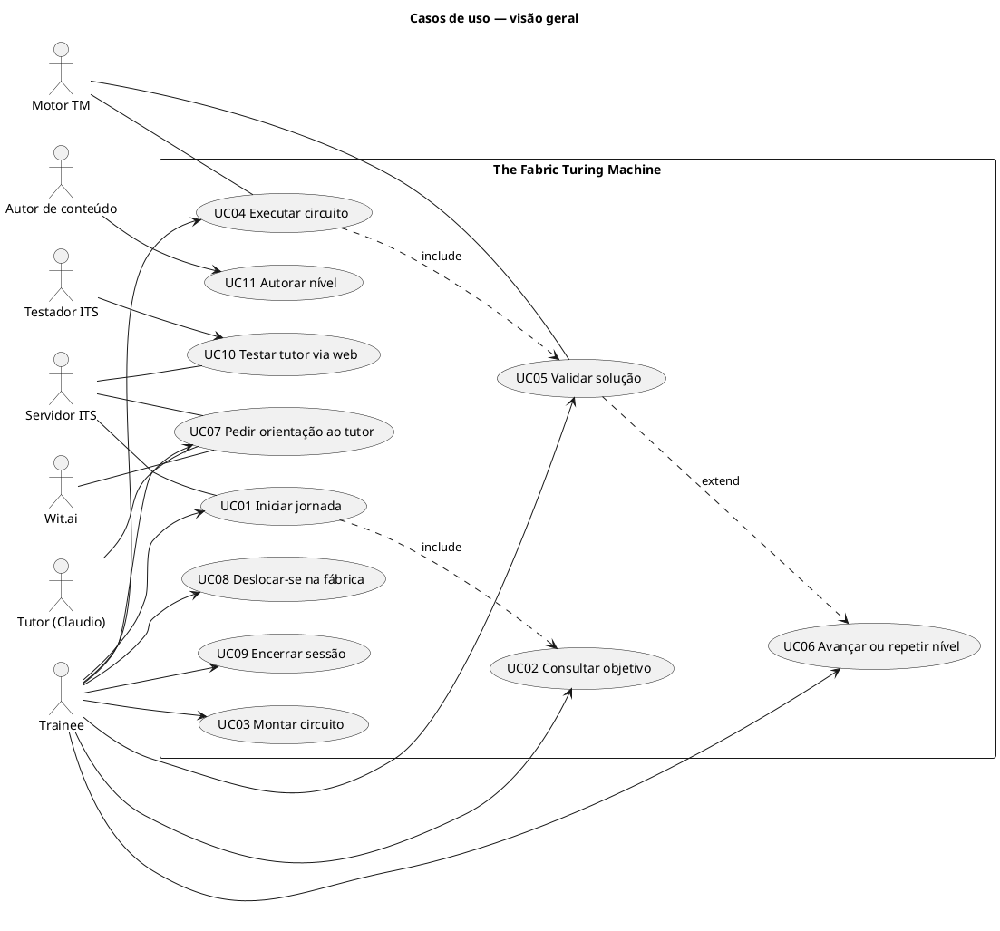
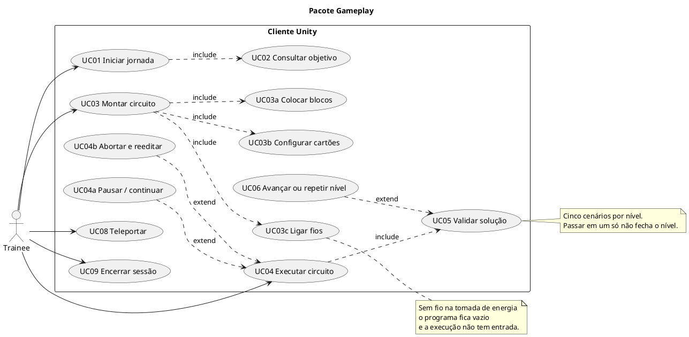
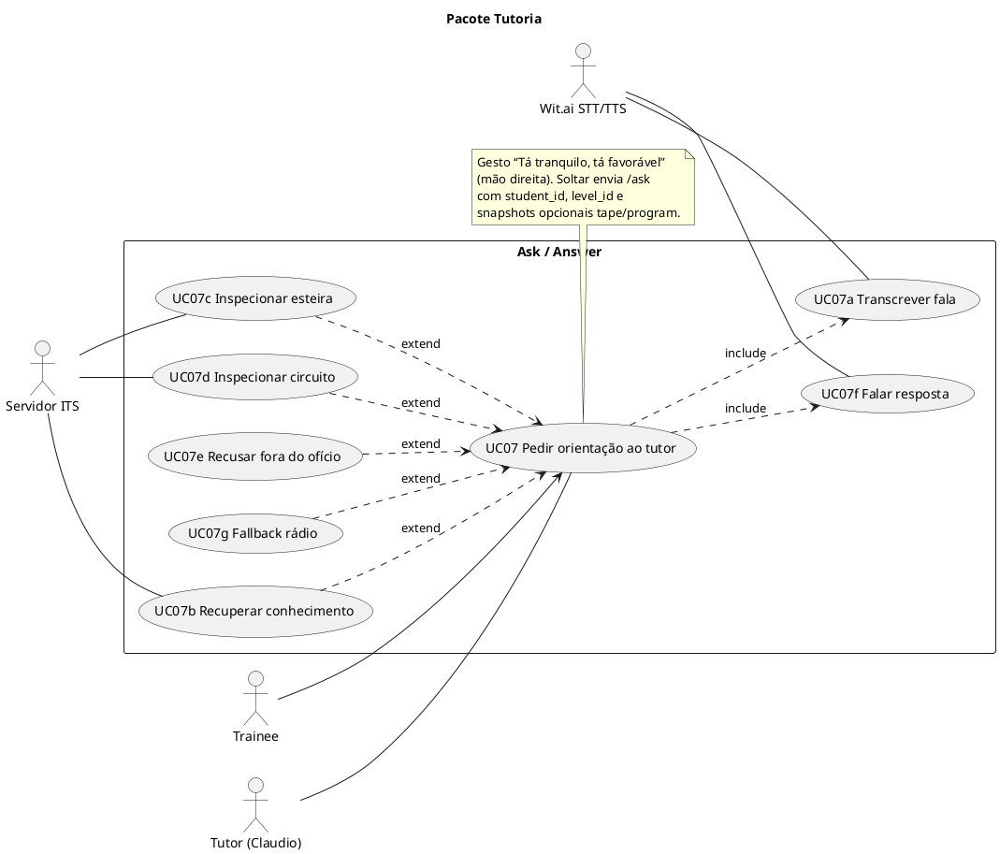
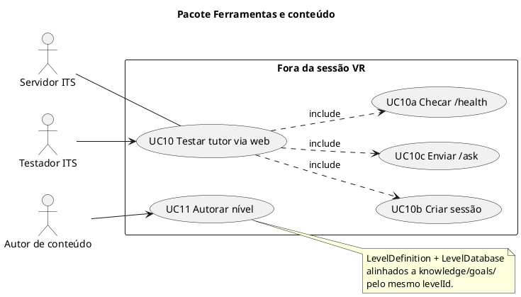
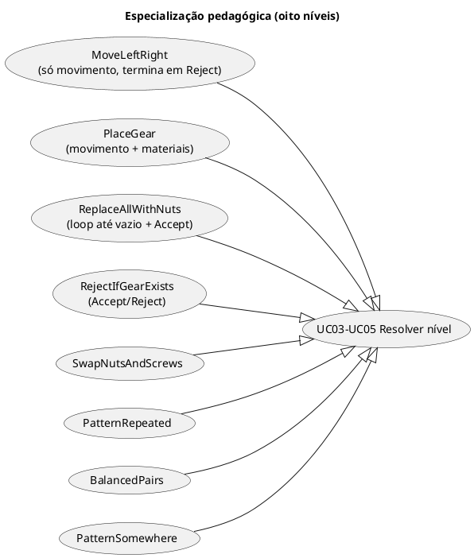
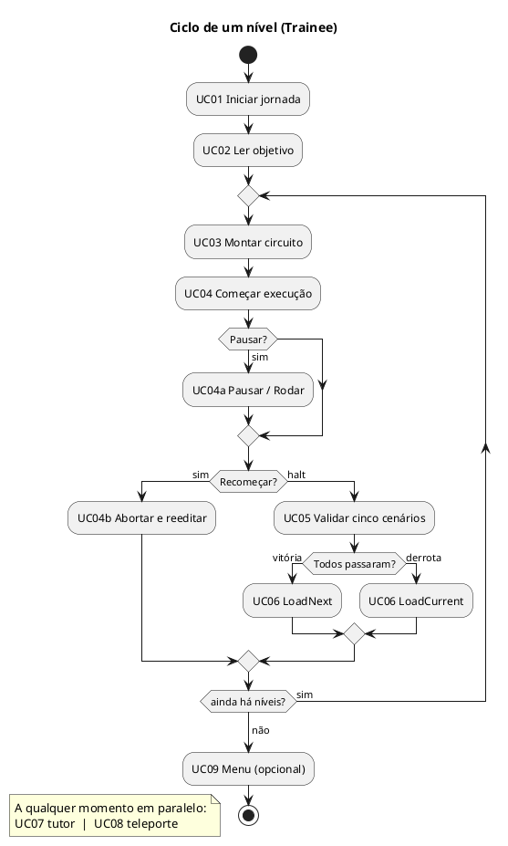

# Casos de uso — The Fabric Turing Machine

Documento de análise do sistema **como está hoje** (Unity + ITS FastAPI). A notação segue UML 2: atores, casos de uso, relacionamentos `include` / `extend` e especificações no estilo Cockburn (fluxo principal + alternativas).

Os diagramas estão em **PlantUML**. Qualquer visualizador PlantUML (VS Code, IntelliJ, [plantuml.com](https://www.plantuml.com/plantuml)) renderiza os blocos `@startuml`.

---

## 1. Contexto

O produto é um simulador pedagógico em realidade virtual: o trainee monta um **circuito** (programa de blocos + fios) que controla o **braço** e a **esteira** (fita da Máquina de Turing). O tutor Claudio responde perguntas por voz via REST (`POST /ask`).

Limite do sistema (caixa preta do diagrama): cliente Unity (`BasicScene`) + servidor ITS (`TuringBotAPI`) + síntese/reconhecimento Wit.ai.

Fora do limite: Gemini (LLM do tutor), corpus markdown, e o Editor Unity usado para autorar níveis.

---

## 2. Atores

| Ator | Tipo | Papel |
|------|------|--------|
| **Trainee** | primário | Estudante de primeiro período; monta circuitos, executa, pede ajuda. |
| **Tutor (Claudio)** | secundário (sistema) | Operário-chefe no mundo do jogo; responde `/ask` em pt-BR. |
| **Servidor ITS** | secundário (sistema) | FastAPI: sessão, RAG, inspeção de esteira/circuito. |
| **Wit.ai** | secundário (sistema) | STT (pt-BR) e TTS (voz inglesa; legendas em pt-BR). |
| **Motor TM** | secundário (sistema) | Simulação + validação de cinco cenários por nível. |
| **Testador ITS** | primário (ferramenta) | Usa o web tester em `/web-tester/` para checar API. |
| **Autor de conteúdo** | primário (Editor) | Define níveis Unity e documentos `knowledge/goals/`. |

O **Trainee** é o ator de valor. Os demais sustentam o objetivo pedagógico: aprender Máquinas de Turing pela metáfora da fábrica.

---

## 3. Diagrama de contexto (visão geral)

---

## 4. Pacote gameplay (Trainee × fábrica)

---

## 5. Pacote tutoria (voz + ITS)

---

## 6. Pacote ferramentas

---

## 7. Especificações dos casos de uso

Convenções:

- **Pré-condição:** o que precisa ser verdade antes.
- **Fluxo principal:** caminho de sucesso.
- **Alternativas:** `extend`, falhas e atalhos.
- **Pós-condição:** o que mudou no sistema.

IDs estáveis (`UC01`…`UC11`) para rastreio. Nomes de botões e gestos seguem o vocabulário da fábrica (esteira, circuito, Começar, Recomeçar).

---

### UC01 — Iniciar jornada

| Campo | Conteúdo |
|-------|----------|
| **Ator primário** | Trainee |
| **Atores de suporte** | Servidor ITS |
| **Objetivo** | Entrar na fábrica com sessão e primeiro nível carregados. |
| **Pré-condição** | `BasicScene` carregada; `TuringBootstrap` inicializou Model/View/Controller. |
| **Gatilho** | Auto-start da cena, ou comando de start a partir de `Menu`. |

**Fluxo principal**

1. O sistema pede `POST /session/new` e guarda `student_id` em `SkillTracker`.
2. O fluxo vai `Menu → Loading → Editing`.
3. O carregador aplica o nível corrente de `LevelDatabase` (oito níveis), escolhe um `ValidationTest` do pool como `ActivePlayTest` e deixa a esteira vazia.
4. A bancada, a esteira vazia e o objetivo ficam disponíveis.
5. **«include» UC02** — o trainee pode ler o objetivo.

**Alternativas**

- **A1.** `/session/new` falha: o cliente ainda entra em edição; perguntas posteriores podem cair em UC07g.
- **A2.** Start a partir do menu (`StartFromMainMenu` / `RunRequested` com estado `Menu`): mesma sequência com sessão nova.

**Pós-condição** | Estado `Editing`; `level_id` alinhado ao nível carregado.

**Entrada no código:** `TuringBootstrap.BeginGame()`, `GameFlowController.Start()`.

---

### UC02 — Consultar objetivo do nível

| Campo | Conteúdo |
|-------|----------|
| **Ator primário** | Trainee |
| **Objetivo** | Entender o que o circuito deve fazer neste nível. |
| **Pré-condição** | Nível carregado (`LevelDefinition` com `title` / `description` em pt-BR). |

**Fluxo principal**

1. O sistema exibe título e descrição do nível na UI de nível.
2. O trainee lê o enunciado (ex.: “mova a esteira duas vezes à esquerda e uma à direita”).

**Pós-condição** | Nenhuma mudança de programa; o trainee sabe o critério de aceite.

Incluído por UC01. Também vale após UC06 (novo ou mesmo nível).

---

### UC03 — Montar circuito

| Campo | Conteúdo |
|-------|----------|
| **Ator primário** | Trainee |
| **Objetivo** | Autorar um programa visual que realize o objetivo. |
| **Pré-condição** | Estado `Editing`. Execução **não** está rodando. |

**Fluxo principal**

1. **«include» UC03a** — blocos da gaveta de blocos da bancada na grade.
2. **«include» UC03b** — cartões da gaveta do braço esquerdo (material ou direção).
3. **«include» UC03c** — fios da tomada de energia até as portas dos blocos.
4. `ProgramWorkbench` reconstrói o grafo, gera fingerprint e compila (`GraphToProgramCompiler`).
5. O programa ativo alimenta simulação e validação (`ProgramChanged`).

**Alternativas**

- **A1.** Tomada sem fio: programa vazio; a máquina não tem entrada.
- **A2.** Compilação falha: o programa anterior é mantido.
- **A3.** Tentativa de soltar blocos durante execução: edição travada (só UC04b destrava).
- **A4.** Cartão no encaixe errado (direção em condição, etc.): o cartão não entra.

**Pós-condição** | Snapshot do circuito disponível para execução e para `/ask` (`program`).

**Entrada no código:** `ProgramWorkbench`, `ProgramEditController`.

---

#### UC03a — Colocar blocos

Pegar bloco (grab / pinça) na gaveta de blocos da bancada de programação e soltar num encaixe válido da grade. Tipos: movimento, materiais, condição, aceitar, rejeitar (o conjunto visível depende do nível).

#### UC03b — Configurar cartões

Encaixar cartão de **direção** no movimento, ou de **material** (engrenagem, porca, parafuso, vazio) em materiais/condição.

#### UC03c — Ligar fios

Arrastar da porta de saída para a de entrada. A tomada só tem saída; Aceitar/Rejeitar só têm entrada; condição tem duas saídas (verdadeira e falsa), ambas precisam de fio. Saída solta encerra o programa (conta como rejeitar se Aceitar/Rejeitar já existem no nível).

---

### UC04 — Executar circuito

| Campo | Conteúdo |
|-------|----------|
| **Ator primário** | Trainee |
| **Atores de suporte** | Motor TM |
| **Objetivo** | Ver o circuito atuar sobre a esteira. |
| **Pré-condição** | Estado `Editing`; circuito compilado (ou vazio). |
| **Gatilho** | Botão **Começar** (não coloca nem remove material). |

**Fluxo principal**

1. O fluxo vai para `Running`; o lote do `ActivePlayTest` aparece na esteira; emite `RunStarted`.
2. O motor produz passos (`SimulationStepProduced`) enquanto a view interpola leitura → escrita → movimento.
3. Fios no caminho de energia usam a cor de preview; o restante fica na cor conectada.
4. O trainee observa braço, esteira e feedback sensorial (áudio/VFX dos canais de fita).
5. A máquina atinge halt (Aceitar, Rejeitar implícito, ou sem transição).
6. **«include» UC05** — validação de todos os cenários do pool.

**Alternativas (extend)**

- **E1. UC04a** — **Pausar** segura o passo atual; **Rodar** continua. Pausar **não** libera a bancada.
- **E2. UC04b** — **Recomeçar** aborta, esvazia a esteira, sorteia outro teste do pool e volta a `Editing`.

**Pós-condição (fluxo principal)** | Halt alcançado; validação disparada.

**Entrada no código:** `GameFlowController.Run()`, `SimulationRunner`, `PlaybackController`, `MachineViewer`.

---

### UC05 — Validar solução

| Campo | Conteúdo |
|-------|----------|
| **Ator primário** | Trainee (recebe o resultado) |
| **Atores de suporte** | Motor TM |
| **Objetivo** | Saber se o circuito vale para **todos** os testes do nível. |
| **Pré-condição** | Halt da execução visível (`HaltReached` → `GameFlowController.Halt()`). |

**Fluxo principal**

1. Estado `Halted → Validating`.
2. `ValidationRunner` executa todos os cenários de `validationTests` (cinco no total).
3. Cada cenário compara halt (Aceitar/Rejeitar), índice do braço e conteúdo da esteira.
4. UI recebe o resumo (`SetValidationSummary`): contagem de lotes em pt-BR, sem nomear o cenário que falhou.
5. Se todos passam → `Victory` (confete / reação do tutor). Senão → `Defeat`.
6. **«extend» UC06** — o trainee pode avançar ou repetir.

**Alternativas**

- **A1.** Um cenário passa e outro falha: derrota. Um único sucesso não fecha o nível.
- **A2.** Programa que não para: o cenário falha.

**Pós-condição** | `LevelOutcome` publicado (`Victory` ou `Defeat`).

**Entrada no código:** `GameFlowController.HaltAsync()`, `ValidationRunner`.

---

### UC06 — Avançar ou repetir nível

| Campo | Conteúdo |
|-------|----------|
| **Ator primário** | Trainee |
| **Gatilho** | Comando **Next** após vitória ou derrota. |

**Fluxo principal**

1. Simulação e view são resetadas.
2. Se o estado anterior era `Victory` → `LoadNext()`.
3. Se era `Defeat` → `LoadCurrent()` (mesmo nível).
4. Volta a `Editing` com edição liberada (**«include» implícito de UC02**).

**Pós-condição** | Nível (mesmo ou seguinte) em edição; `level_id` atualizado no `SkillTracker`.

**Entrada no código:** `GameFlowController.Next()`.

---

### UC07 — Pedir orientação ao tutor

| Campo | Conteúdo |
|-------|----------|
| **Ator primário** | Trainee |
| **Atores de suporte** | Tutor, Servidor ITS, Wit.ai |
| **Objetivo** | Tirar dúvida de fábrica sem receber o circuito completo sem pedir. |
| **Pré-condição** | Sessão com `student_id` (se `/session/new` tiver funcionado). |
| **Gatilho** | Gesto “Tá tranquilo, tá favorável” na **mão direita** (segurar = ouvir; soltar = enviar). Alternativa de desenvolvimento: botão de mic / tecla **T**. |

**Fluxo principal**

1. **«include» UC07a** — STT Wit (`turing_stt`) transcreve pt-BR; texto parcial no visor da palma.
2. Silêncio (~15 s) ou soltar o gesto publica `TranscriptionReady`.
3. `ITSClient` envia `POST /ask` (`student_id`, `level_id`, `question`, `tape`/`program` se o cache estiver sujo).
4. **«extend» UC07b** — Gemini chama `search_docs` (até 3 vezes) no corpus `knowledge/`.
5. **«extend» UC07c / UC07d** — `check_tape` / `check_program` no máximo uma vez cada.
6. O tutor devolve `reply` em pt-BR.
7. **«include» UC07f** — TTS Wit (`turing_tts`) fala; legendas do agente em pt-BR; animação de fala.

**Alternativas (extend)**

- **E1. UC07e** — Pergunta fora do ofício: recusa curta, sem RAG de conteúdo alheio.
- **E2. Cumprimento** (`oi`, `bom dia`, …): resposta curta, sem busca.
- **E3. UC07g** — Host inalcançável ou sem `ITSClient`: `AskResult` de sucesso com *“O rádio não ta muito bom.”*
- **E4.** Captura Wit para antes do envio: cue “câmbio” na palma; o trainee refaz o gesto.
- **E5.** Fallback Gemini ausente no servidor: prefixo de interferência + recortes pt-BR dos chunks (sem inspect).

**Pós-condição** | O trainee ouviu/leu uma resposta; o servidor **não** guarda histórico nem BKT.

**Entrada no código:** `HandGestureMicListener`, `VoiceInputHandler`, `ITSClient`, `agent.py`, `AgentTTS`.

---

### UC08 — Deslocar-se na fábrica (teleporte)

| Campo | Conteúdo |
|-------|----------|
| **Ator primário** | Trainee |
| **Objetivo** | Ir até bancada, esteira ou tutor sem locomover o corpo. |

**Fluxo principal (mãos)**

1. Mão direita: gesto Homem-Aranha com mindinho recolhido (polegar + indicador).
2. Raio no chão válido; pinça confirma.
3. Abrir a mão cancela.

**Fluxo (controle XR):** comando de locomoção configurado → mira → seleção.

**Alternativa:** raio vermelho = obstáculo ou fora da área; apontar chão livre.

Não altera circuito nem esteira.

---

### UC09 — Encerrar sessão / voltar ao menu

| Campo | Conteúdo |
|-------|----------|
| **Ator primário** | Trainee |
| **Gatilho** | Tecla **M** / `OnMenuRequest` / `ReturnToMainMenu`. |

**Fluxo principal**

1. O fluxo tenta `Menu`.
2. A sessão local ativa é limpa; o próximo start pede `/session/new` de novo.

**Nota de estado atual:** a UI de menu ainda não está totalmente ligada; o gancho de runtime existe.

**Entrada no código:** `GameFlowController.ReturnToMenu()`, `TuringBootstrap.ReturnToMainMenu()`.

---

### UC10 — Testar tutor via web

| Campo | Conteúdo |
|-------|----------|
| **Ator primário** | Testador ITS |
| **Objetivo** | Exercitar o contrato REST sem Unity. |
| **Pré-condição** | Processo FastAPI no ar (`/` redireciona a `/web-tester/`). |

**Fluxo principal**

1. **«include» UC10a** — `GET /health` (`status`, `tutor_provider`, `documents`).
2. **«include» UC10b** — `POST /session/new`.
3. **«include» UC10c** — `POST /ask` com pergunta, `level_id` e snapshots opcionais; inspeciona `reply`, `tokens_in`, `tokens_out`.

**Pós-condição** | Diagnóstico da API; nenhuma persistência de aluno.

---

### UC11 — Autorar nível

| Campo | Conteúdo |
|-------|----------|
| **Ator primário** | Autor de conteúdo |
| **Objetivo** | Publicar um nível jogável e tutoriável. |

**Fluxo principal**

1. Criar/editar `LevelDefinition` (título, descrição pt-BR, `levelId`, cinco testes).
2. Registrar em `LevelDatabase` (ordem de jogo).
3. Espelhar `level_id` em `TuringBotAPI/knowledge/goals/` e em `LevelID`.
4. Validar cena (`MvpSceneWiringValidator`) e um passe manual editar → executar → validar.

**Invariante:** `levelId` Unity = frontmatter do goal = constante `LevelID`. `AppendScrew` não faz parte da progressão.

---

## 8. Objetivos pedagógicos por nível (especializações de UC03–UC05)

Não são atores novos: são **cenários de UC05** que o trainee resolve com o mesmo conjunto de casos de uso.

| Ordem | `levelId` | Intenção |
|------:|-----------|----------|
| 1 | `MoveLeftRight` | Sequência fixa de movimentos. |
| 2 | `PlaceGear` | Escrever engrenagem em três posições à direita. |
| 3 | `ReplaceAllWithNuts` | Varredura + escrita até vazio; fechar em Aceitar. |
| 4 | `RejectIfGearExists` | Reconhecer linguagem: rejeitar se houver engrenagem. |
| 5 | `SwapNutsAndScrews` | Trocar porca ↔ parafuso; Aceitar no fim. |
| 6 | `PatternRepeated` | Aceitar só se a esteira útil for `(engrenagem, porca, parafuso)*`. |
| 7 | `BalancedPairs` | Aceitar se \#engrenagens = \#porcas (usar a fita como memória). |
| 8 | `PatternSomewhere` | Aceitar se o trio existir em qualquer posição. |

Cada um tem **cinco** `ValidationTest` no pool `validationTests` (sem teste principal distinto).

---

## 9. Diagrama de atividades — ciclo de um nível

Complemento aos casos de uso (UML Activity), para o ciclo que o trainee vive:

---

## 10. Relacionamentos (resumo)

| Relação | De → Para | Motivo |
|---------|-----------|--------|
| «include» | UC01 → UC02 | Começar o nível implica ver o objetivo. |
| «include» | UC03 → UC03a/b/c | Circuito = blocos + cartões + fios. |
| «include» | UC04 → UC05 | Halt da execução visível dispara validação. |
| «include» | UC07 → UC07a, UC07f | Perguntar é falar e ouvir resposta. |
| «include» | UC10 → UC10a/b/c | O tester exercita os três endpoints. |
| «extend» | UC04a, UC04b → UC04 | Pausa e aborto são opcionais. |
| «extend» | UC06 → UC05 | Next só após vitória/derrota. |
| «extend» | UC07b–g → UC07 | RAG, inspect, recusa e rádio são condicionais. |
| generalização | L1–L8 → UC03–UC05 | Mesmo caso de uso, critérios diferentes. |

---

## 11. Rastreio implementação

| UC | Cliente | Servidor / dados |
|----|---------|------------------|
| UC01 | `TuringBootstrap`, `GameFlowController.Start` | `POST /session/new` |
| UC02 | `LevelDefinition`, UI de nível | `knowledge/goals/*.md` |
| UC03 | `ProgramWorkbench`, `GraphToProgramCompiler` | snapshot `program` em `/ask` |
| UC04 | `GameFlowController.Run`, `PlaybackController` | — |
| UC05 | `ValidationRunner`, `LevelOutcome` | cinco `ValidationTest` por nível |
| UC06 | `GameFlowController.Next` | `level_id` no `SkillTracker` |
| UC07 | `ITSClient`, `VoiceInputHandler`, `AgentTTS` | `POST /ask`, `agent.py` |
| UC08 | XR locomotion / hand tracking | `knowledge/gameplay/02-teleport.md` |
| UC09 | `ReturnToMenu` | sessão local limpa |
| UC10 | — | `web-tester/index.html` |
| UC11 | `Assets/Levels/*` | `knowledge/goals/` + `LevelID` |

---

## 12. Fora de escopo (não são casos de uso atuais)

- Telemetria BKT, `POST /event`, `POST /hint`, WebSocket `/ws/live` — removidos deste MVP.
- Menu principal com UI completa — gancho de estado existe; tela ainda não é o fluxo principal.
- Editor visual de blocos em UI Toolkit / metáfora têxtil completa — roadmap, não runtime obrigatório.

---

## 13. Como ler este documento

1. Comece pelos diagramas das seções 3–5.
2. Use as tabelas da seção 7 quando for implementar ou testar um fluxo.
3. Níveis (seção 8) são variações de dados, não novos atores.
4. Comportamento de cliente/servidor em detalhe: `docs/client/README.md` e `docs/server/README.md`.
